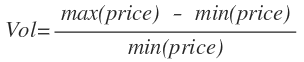
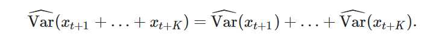
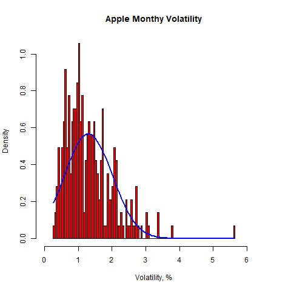
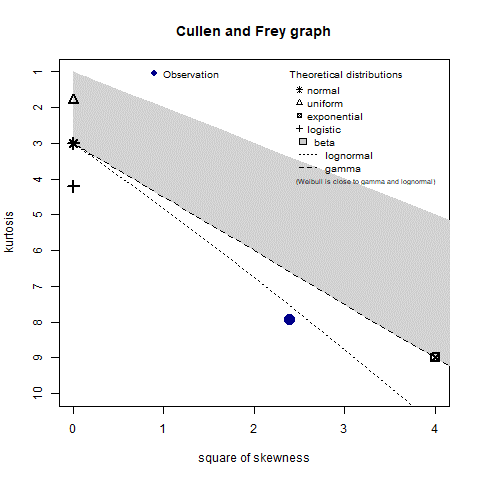
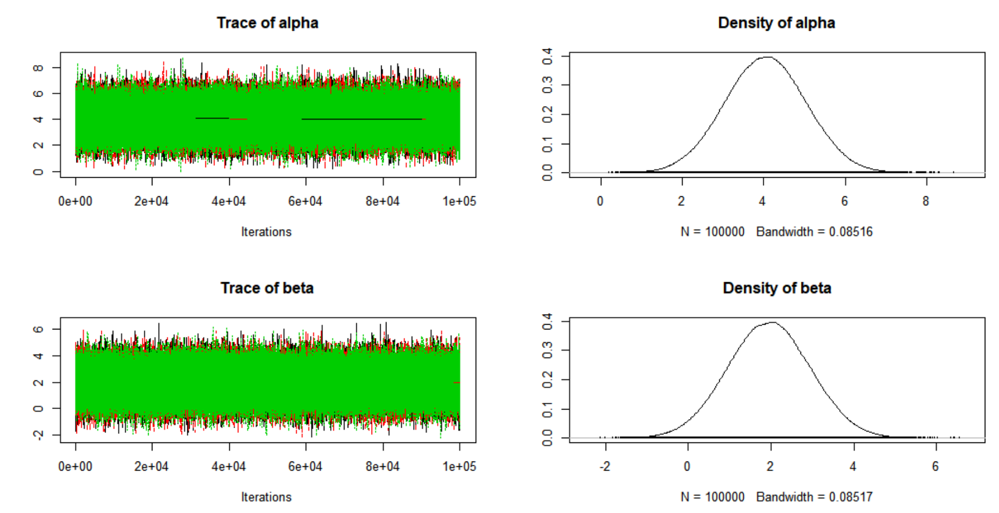
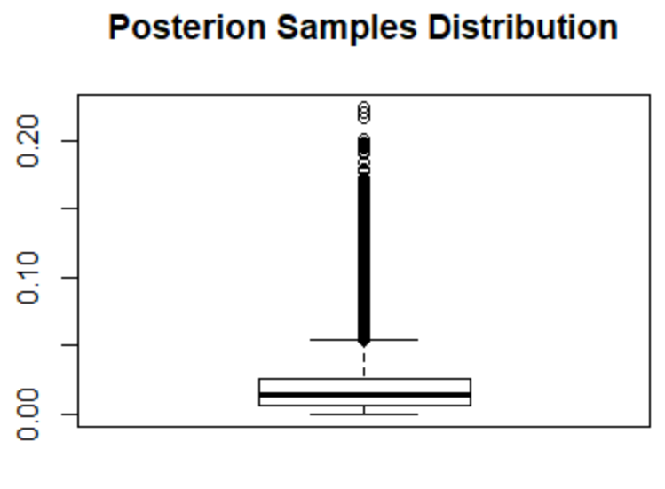

# QuantFin - Stock Volatility Simulation

Wednesday, December 26, 2018

**Problem**

In the financial world, it is often can be found examples of the application of the modeling price return distribution with an assumption of its normality. Applying the normal distribution in the price simulation makes the model relatively simple and computational chip. It also a very convenient solution when an analyst doesn&#39;t have any additional information about the underlying financial asset. Such assumptions can lead to the underestimation of the &quot;long tail&quot; type evens, such as market shocks/recessions and so fore.

This research is exploring how to estimate a price distribution from the historical data and use it in the &quot;Mont Carlo&quot; price simulations.

**Abstract**

Volatility can be identified as a difference between the minimum and maximum price in the defined period. If the initial stock price and monthly volatility are known, a risk of the high volatility can be estimated. In another world, the probability that stock&#39;s price at the end of the month will be lower than at the beginning.


Where &quot;price\_a&quot; is simulated current/ending price of the period, and &quot;price\_b&quot; is a starting price of the period.

Then we can set up the &quot;risk thresholds&quot; that could be identified as: &quot;If an asset has more than n% risk of negative return, we should consider it as non-inestimable&quot; or &quot;If an asset has more than n% risk of negative return we won&#39;t open a short option position on it&quot;

&quot;Simulated&quot; price means a theoretical price drown from the approximate distribution of the asset volatility. If the distribution is known (or at least the most appropriate one) we can use Monte Carlo simulations to &quot;look to the future&quot; and estimate where price could be after n-periods of time.


**Plan**

- Acquire at least a last ten years of historical market data for major public trading companies.
- Using a stock performance, generate an empirical distribution for each financial asset
- Fit different probability density functions and estimate the likelihood for each of them
- Create a Markov Chain Monte Carlo hierarchical model for volatility simulations.
- Use samples from the stimulation to estimate the cumulative distribution function for price volatility.

**Data Source**

The data source I used for this research Yahoo Finance, an open online database for economic and financial data. Historical quotes were loaded directly using R API without any changes and preprocessing.

**Model**

To calculate monthly volatility, I got historic market data from yahoo finance, aggregated it by month and estimated relative volatility with:




It&#39;s important to mention that this formula is allowed only for intraday behavior. Applied to monthly/yearly aggregated data it won&#39;t represent the risk of investment because it doesn&#39;t consider hidden action of the asset.

To estimate stock&#39;s monthly volatility, we need to find it&#39;s mean daily volatility, calculate the variance for each day observation and then sum it over.

Assuming that each volatility observation is independent, the monthly volatility can be expressed from daily volatility using the following expression:



Here&#39;s a density plot of the monthly stock volatility and fitted normal distribution function:



As we see, the most decency mass is concentrated in 0%-4% range. We also recognize that there was a couple of month with extremely high volatility when stock returned around 6% ROI.

It&#39;s also clear that the Normal distribution cannot be used for volatility approximation. The normal distribution underestimates the probability of medium and high volatility. We need to consider using more &quot;fat tail&quot; like a model.

Now, let us try to fit different probability density functions and see which one will work the best. To find it out we need to find parsimonious approximate descriptions.

Here&#39;s a plot of the kurtosis and squared skewness of our samples:




It gives some basic estimations about potential candidates for theoretical distribution.

We see that the closest estimation will be a lognormal distribution.

The AIC statistics for Weibull, normal, gamma and log-normal are the following:


```
>aic_df

   weibull    gamma     norm    lnorm

1 550.6034 525.3154 609.4202 520.4791
```

As we see, both gamma and log-normal distribution have fit the data well.

I&#39;ll test both gamma and lnorm models separately and see which gives a better return on the backtesting stage. Let&#39;s start with a gamma distribution. Because it has higher kurtosis, it better represents the underlying asset behavior.

Solving Maximum Likelihood estimation for the Gamma distribution, we can get the best fitted (Shape, Rate) parameters:

```
> fit_stat[[1]]$gamma$estimate
   shape     rate
3.848280 2.952326

```
Then, using these parameters, we can create a simple hierarchical Bayesian model for sampling monthly stock volatility. To create the MCMC model, we&#39;ll use JAGS, and it&#39;s R API. The string representation of the model looks following:

Using these parameters we drown random vector form Gamma (shape, rate) using founded parameters. After that, we can calculate the Kolmogorov-Smirnov test to identify what is the probability that simulated and observed data points are from the same Gamma distribution.The Kolmogorov–Smirnov statistic is 0.041. Hence, for the significance level 0.01 level, the p-value is 0.072, we can strongly assume that the observed samples are drowned from a Gamma distribution.

We can now use the obtained distribution as a prior distribution for a Bayesian model for volatility simulation.

For simulations, we&#39;ll use JAGS, and it&#39;s R API. Here&#39;s a model&#39;s string for rjags:

```
"model {
  #Likelihood
  for(i in 1:n) {
    y[i] ~ dgamma(alpha,beta)
  }
  #Prior
  alpha ~ dnorm(a_mu,1.0/sig_sq)
  beta ~ dnorm(b_mu, 1.0/sig_sq)
  "

```

Datapoints are draws from Gamma distribution with alpha and beta parameters. Alpha and beta for their part are drowned from a normal distribution with mu and 1/sig^2 square parameters. Mu parameter is set up as an MLE from the KS test, while sig^2 is remaining free.

The simulations were run in three chains with 1e5 iterations each. The burn-in period was set up to 1e3 iterations.

Here&#39;s a trace plot for the simulations:

The trace plot for the model looks the following:




Autocorrelation levels and Gelman-Rubin diagnostic looks good:

```
>autocorr.diag(mod_sim)
               alpha         beta
Lag 0   1.0000000000 1.0000000000
Lag 1   0.0020603758 0.0017301907
Lag 5   0.0003452382 0.0004947912
Lag 10  0.0007025614 0.0007559833
Lag 50 -0.0005045586 0.0023457908
>gelman.diag(mod_sim)
Potential scale reduction factors:

      Point est. Upper C.I.
alpha          1          1
beta           1          1

Multivariate psrf

1

```

We can reasonably assume that the chain converted and exploring stationary distribution.

Now, let&#39;s tweak the model to find the best fit for the real-life patterns. Using the free sigma parameter, we can control the maximum &quot;allowed&quot; size of outliers in volatility and probability of high volatility periods.

Here&#39;s a result of ten simulations with gradually decreasing sigma from 80 to 0.07:

```
>results
       Sigma Mean.Volatility Max.Volatility High.Volatility.Probability
1  3.200000e+02      0.01474138     0.09212599                 0.004666667
2  1.600000e+02      0.01548248     0.10307916                 0.011666667
3  8.000000e+01      0.01668404     0.11868926                 0.021166667
4  4.000000e+01      0.01837978     0.14249831                 0.046666667
5  2.000000e+01      0.02086177     0.21776297                 0.086000000


```

And the summary from observed data:

```

> mean(empirical_distribution> 3*mean(empirical_distribution))
[1] 0.003521127
> summary(empirical_distribution)
    Min.  1st Qu.   Median     Mean  3rd Qu.     Max.
0.002717 0.008045 0.011309 0.013035 0.016699 0.056315

```
High.Volatility.Probability column is defined as a probability that monthly volatility will be more than three times higher than average.

We see that the best fit to empirical data will be a model with a sigma parameter equal to 40.

The boxplot for the result distribution is the following:





```
>mean(y_hat)
[1] 0.06417608

```

We see that most of the distribution mass lay around 6% with high volatility outliers. Indeed, the AAPL stock price had 20% volatility in late 2018 after more than ten years of stable growth.


**Conclusion**

As it was shown, JAGS simulations yield a realistic distribution which accounts low-probability &quot;tails&quot; events. Estimated values generated by JAGS can be used to define the probability for the different price levels and use them to evaluate the risk of the specific finance asset.
